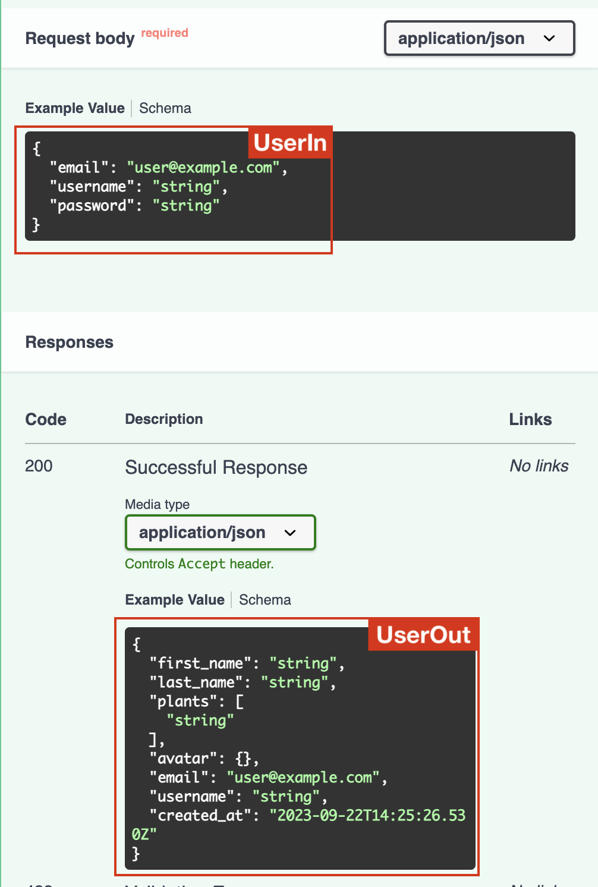
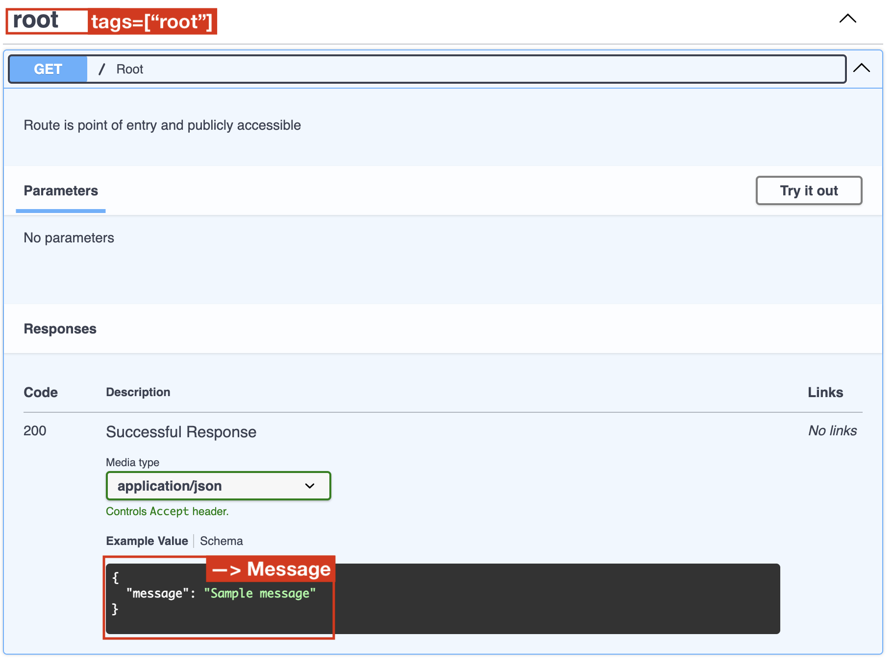

# FastAPI, MongoDB Boilerplate with OAut2 Authentication/Authorisation

A boilerplate to scaffold an API with a user CRUD functionality, connected to MongoDB.

<small> Disclaimer: This is a very basic implementation and some changes and improvements may be implemented in the days to come. as of Sept 22 2023 </small>

## TL;DR

If you are in a hurry and know what you're doing:

- clone this repository
- git init
- create a virtual environment using Python 3.11
- `pip install -r requirements.txt` from your terminal
- change the name of the file fake.env to .env
- insert the values needed in the .env file
- run `python -m server` from your terminal
- visit your localhost

## How this project is organised (for those who want to understand)

<details>
In general, the connection between [FastApi](https://fastapi.tiangolo.com/) and [MongoDB](https://www.mongodb.com/) is initiated with Motor, and the communication is facilitated by [Beanie](https://beanie-odm.dev/), an object-document mapper, which in turn inherits from [Pydantic](https://docs.pydantic.dev/latest/) for data validation.

### The connection to the MongoDB

```py
async def init_db():
    client = motor.motor_asyncio.AsyncIOMotorClient(env["MONGO_URI"])
    await beanie.init_beanie(
        database=client[env["MONGO_DB"]],
         database=client[env["MONGO_DB"]]

    )
```

In `mongodb/db.py` a single function, `init_db()` connects to your project in MongoDB (`client = ...`)and initialises Beanie (`beanie.init_beanie ...`), so that Beanie knows which database in the project it should connect to ` database=client[env["MONGO_DB"]]` and which collections to create based on the Models passed: ` database=client[env["MONGO_DB"]]`. The values are passed through .env values for an extra level of protection.

### Understanding the Models

Two basic class types are used:

```py
class UserBase(Document):
    """User database representation"""
    model_config = ConfigDict(extra='allow')

    first_name: Optional[str] | None = None
    last_name: Optional[str] | None = None
    created_at: Optional[datetime] = datetime.now(central_europe)
    disabled: bool = False
    email: Optional[EmailStr] | None = None
    username: Optional[str] | None = None
    password_hash: Optional[str] | None = None

    class Settings:
        name = "Users"
```

The first inherits from `Document` and is a **Beanie** model. This is the corresponding model for the document in the database. With an instance of this class you can retrieve, add, update, or delete documents from the collection. The first line, `model_config = ConfigDict(extra='allow')` indicates that new fields can be added to the model if necessary, in addition to the original fields. The subclass `Settings` indicates the name of the collections under which the document lives.

```py
class UserUpdate(BaseModel):
    """User database representation"""
    model_config = ConfigDict(extra='allow')

    first_name: Optional[str] | None = None
    last_name: Optional[str] | None = None
    email: Optional[EmailStr] | None = None
    username: Optional[str] | None = None

```

The other model inherits from `BaseModel`, a Pydantic class. These classes are used to interact with the controllers and serve as a go-between the front end and the back. In addition, FastAPI can use some of these models as response types, which populates its documentation and offers type hinting.

For example, in this route for adding a new user:

```py
@user_route.post("/add")
async def add_user_to_db( user: UserIn)-> UserBase:
    new_user = await create_user(user)
    return new_user
```

We specify the _type_ UserIn for the parameter `user` in the request body and the _type_ UserOut for the response body.

FastAPI will use them to illustrate sample values. Having different classes allows you to have different configurations from the UserBase model.



### Understanding FastAPI

If the Models are the "meat" of the project, FastAPI is the "skeleton" and the entry point for this body is `server.py` (others may choose to call it `main.py`).

To have the most basic API, the `server.py` file needs to:

- import FastAPI and then initialise `app = FastAPI()`
- define a route:

      ```
      @app.get("/")
      def root() :
          return "Hello World"

      ```

- launch the server using uvicorn.

And _voilá_ you have an API with a single route.

#### Testing your routes

Your API is now live and you can access it at `http://127.0.0.1:8000/`. If you add `/docs` at the end of this path, then you will be able to see and test your roots as you create them.

In this boilerplate the `server.py` file is only a little more developed but not more complex.

The following code assures that your future front-end app like React (traditionally localhost:3000) is trusted by the this back-end (localhost:8000):

```py
origins = [
    "http://localhost:3000",
    "http://localhost:8000",
]

app.add_middleware(CORSMiddleware,
                   allow_origins= origins,
                   allow_credentials = True,
                   allow_methods=["*"],
                   allow_headers=["*"], )
```

To the "root" or "home" route, I have added a couple of items that are purely aesthetic:

```py
@app.get("/", tags=["root"])
def root() -> Message:
    welcome_message = Message(message="""Welcome ...""")
    return welcome_message
```

Here `tags=["root"]` adds a heading over the route, and a `Message` model is used for type hinting and to populate the sample return.



To avoid cluttering this file, we import the rest of the routes as a cluster instead of writing them in here.

```py
app.include_router(user_route, prefix="/users", tags=["users"])
app.include_router(token_route, tags=["token"])
```

The first cluster of routes, the user_route, has `prefix="/users"` which indicates that any routes I create with the "user_route" decorator, will be prefixed thus.

To connect to the MongoDB automatically every time the API is launched:

```py
@app.on_event("startup")
async def connect():
    await init_db()
```

And finally, instead of using the uvicorn terminal command to start the server (Because I can never remember it), we use:

```py
if __name__ == "__main__":
    uvicorn.run(reload=True, app="server:app")
```

which then allows us to simply type (if you have activated your virtual env):

```shell
python -m server
```

### The Routes / Functions relationship:

Routes are organised inside 'routes' folder in one file per path, so all CRUD routes for path `/users/...` are in the file `user_routes.py`.

Each route may call one or more function. The functions for each of these routes are in 'controllers'.

### How do I register a new user:

The first post route in the api, `/users/add` simply takes a json body request with email, username, and password. You can try this out by editing the [request body here](http://127.0.0.1:8000/docs#/) (once you have launched the server).

This route calls the function `create_user` which in addition to saving the name an email, and adding a default avatar for fun, it also creates a hashed_version of the password, which is used for authentication.

Most routes require that a user be authenticated in order to be granted authorisation to visit a route.

### How does authentication work?

Authentication/authorisation functions are not passed in the body of the route function the same way other functions (controllers) are like the `create_user()` for example.

Instead one function, `get_current_user` is passed as a dependency parameter, like this ... `Depends(get_current_user)]`. The complete function looks like this:

```py
@user_route.get("/all")
async def read_all_users(current_user: Annotated[UserBase, Depends(get_current_user)])->list[UserBase]:
```

### What does `get_current_user` do?

This function is the entry point for handling authentication. Just like the route has this dependency, `get_current_user` itself also has a dependency, it needs `OAuth2PasswordBearer(tokenUrl="token")`.

Basically the OAuth2 authentication schema describes the type of authentication needed and where it will be looking for a response from a route: `/token`. The response from this rout is a "token".

- This token is decoded: `payload = jwt.decode(token, SECRET_KEY, algorithms=[ALGORITHM])`
- The username retrieved: `username: str = payload.get("sub")`
- and the user data retrieved with: `get_user_by_username(username=token_data.username)`

### What about the `get_current_active_user()`?

This function adds another layer of authorisation. It uses `get_current_user()` to locate the user and if the User has a key "disabled" = False, then the user data is accessible.

So the user data is only accessible if the user exists, was correctly authenticated, and is active.

### But how do I get a token?

When a user signs in (the `/token` route), the api expects a form-data request with username and password. That information is passed to the `authenticate_user()` function.

This function does two things:

- It verifies that the user is in the database with `get_user_by_username()`, and if it is,
- it verifies the password with `verify_password()`

The second function uses a cryptography library to compare the password passed in the login process, with the hashed_password that was created when the user registered.

If the credentials match, then the route creates a token with a username, and an expiration time encrypted in the token. The endpoint returns this as a JSON object with `token_type` and `access_token` keys. These keys are a mandatory format of the OAuth scheme.

</details>
